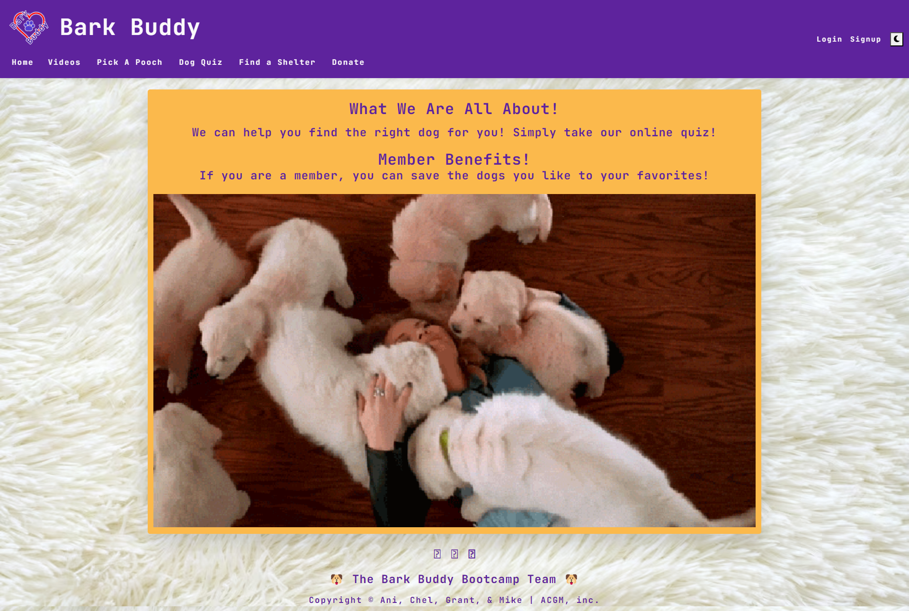
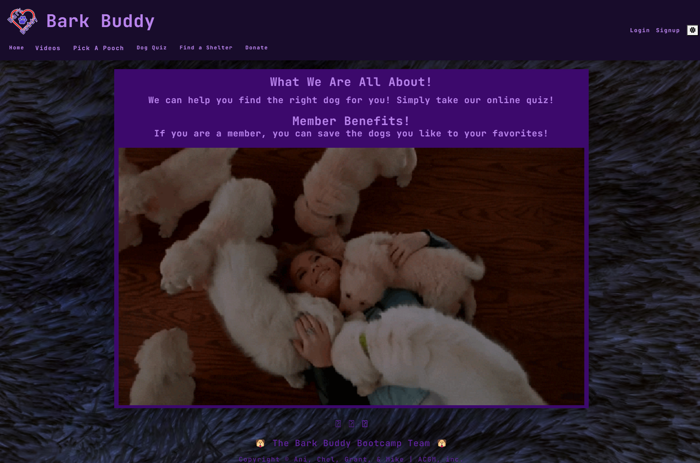

🐶 Bark Buddy 🐶

## Description ✏️

There are many different dogs, but which one is for you?  
Narrow down your search with a quick quiz and then browse for adoptable dogs through our Pick a Pooch search! 
You can even find a shelter and donate!

## User Story 📖

As an individual looking for a dog,
I want to choose the right dog,
so everyone is happy!

## Table of Contents 📖

- 
- 
- 
- 
- 
- 
- 
- 

## Deployed Link 🔑

You can view this through this link:
[Repository link:](cf-bark-buddy.herokuapp.com)

## Tests 🧪

User testing

## Usage &#128161;

[Repository link:](https://github.com/123sites/bark-buddy)

This can be used for anyone needing to find the right dog for them!
Also, they can find a shelter and donate!

## Screenshot 🎯

Light mode:

Dark mode:

## Credits 👈

Our Team:

- Ani Toal
- Chel Freitas
- Grant Willis
- Mike Fazio

## License 📝

The MIT license is in the GitHub repository. Click to link to view it:
[MIT License](https://github.com/123sites/bark-buddy/blob/main/LICENSE)

## Features ✍

- Uses a web manifest
- Uses a service worker for offline functionality
- Is installable
- MERN Stack
- Apollo Server
- Coolors color palette
- Light and dark mode

